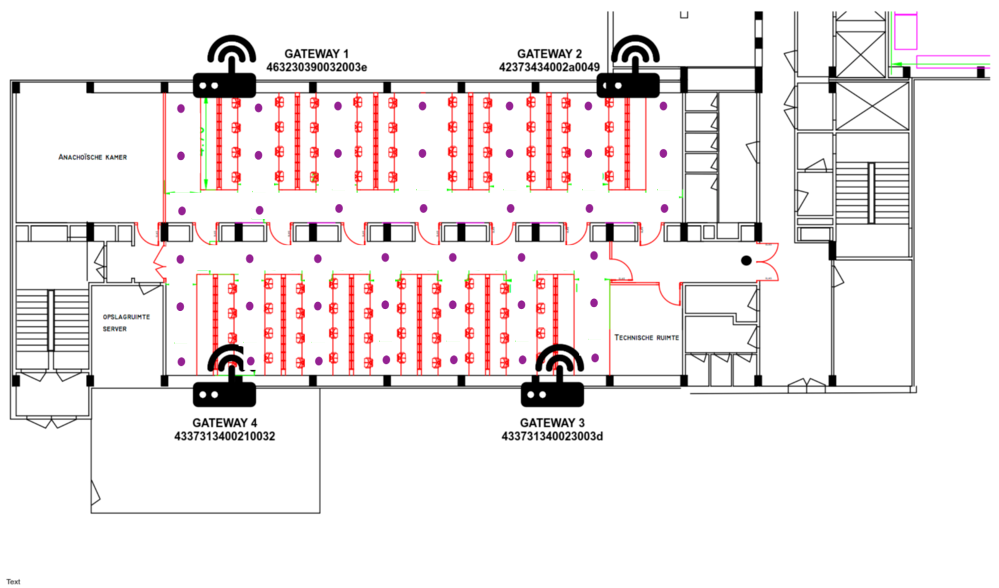
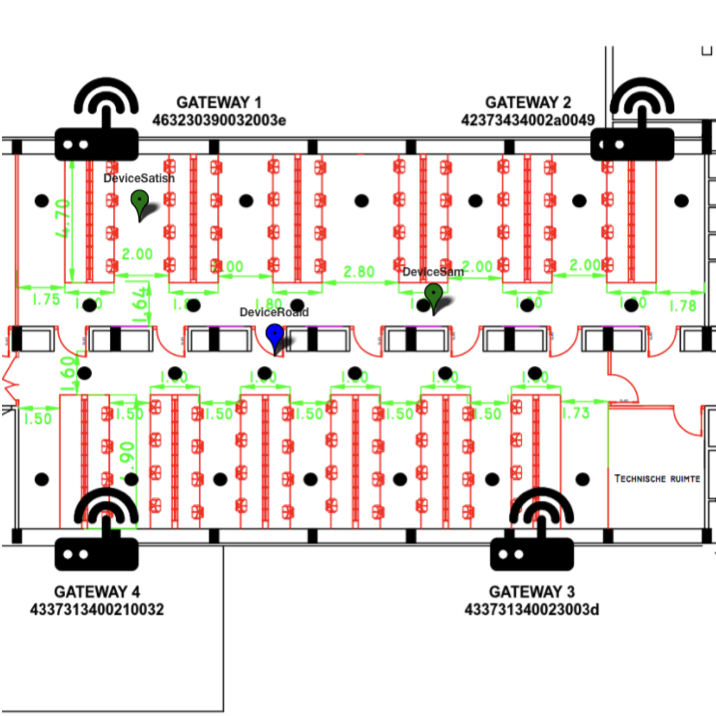

# SmartHouse

What is the application:
(Satish, Roald, Stevie, Sam)

The goal of the project is to create a smarthouse which tracks the person inside the house and will maximize energy efficiency. 

To achieve this goal we have an end device which should be on the user at all times. This end device will trigger an interrupt everytime the user moves a certain period of time. This interrupt then wakes up the device, which then tries to send a dash7 message (containg desired temperature and current temperature). This data is processed by the back-end which will extract these temperatures and send them to a visualisation platform. The back-end will also localise the device and send this data to the visualisation platform. In case the dash7 messages fail, our system will opt for LoraWan. It will send a lora packet (without receiving an ack), this happens when the person is outside of his house (far from dash7 gateways). 

The implementation is done on different levels: Embedded software(1), back-end(2), localisation(3) and visualisation(4). Confirmed afterwards using energie profiling(5). 

Neccesity:

– Nucleos; 1 or more mobile
– Sensors: temperature, acceleratoreter
- localisation: Dash 7.

HARDWARE: 
- STML4xx
- OCTA Connect: 
Temperatuur: SHT31
Accelerometer: LSM303AGR
Lightsensor: TCS34725
- SHIELDS:
Lora: Murata
Dash7: Murata

# Embedded software(low powering):
by satish

Most of these steps are documenten and are in the 'Embedded' folder. 
To summarize the steps taken:
- Enable stopmode
- problem encountered, watchdog freeze in stopmode
- Configure accelerometer to work in low power mode and with double click recognition to mimick the walking.
- Configuring dash7, and lora. Figuring out the way to make payloads.
- Setting interrupts for the buttons (on the octa) and writing code for ease of localisation 
- NVIC priorities for buttons
- Setting up the BLE-chip (research+stack) and enabling uart to communicate with the chip.
- Correctly seting up the BLE-stack (uart-lines) and writing code to achieve communication between BLE chip and device.
Future improvements:
- Using standby mode instead of stopmode
- Disabling all the unused hardware
- lowering clock frequency
- Improving flow for lora communication. 

# Localisation:
by sam

The indoor localisation for the project is realised by using a localisation method based on signal strength. 
From D7 messages the signal strengths are extracted, which are received by the gateways which are setup in the area. 

## Fingerprinting
Fingerprinting is used to achieve the ability to locate the active device in the area. 
The two fases of fingerprinting consist of:
### 1. Offline fase
 In the offline fase the database is build, which is used in the second fase. 
 Below an overview is presented of all the points of intrest (purple points) where measurements are conducted.

 
 To perform the measurements the databasebuilder.py script is used. A flowchart of the databasebuilder program can be seen     at the end of the localisation section. 
 For each point of interest the user just needs to give the coordinates of the point and the DB will be build automatically.
 
### 2. Online fase
 In the online fase a measurements is conducted. This sample is compared against the training database.
 The euclidean distance is calculated againts all samples of the DB. 
 kNN is used to find the most appropriate locations. 
 The total flow of the active localisation proces can be seen in the flowgraph below. 
 The code that is used in the active fase of the localisation proces can be found in localisation_final.py
 
 The final result is a location which can be visualized. An example of the location visualized in the specific environment can be seen in the image below. 
 
 

## Database builder

## Localisation

## Back-end:

By Stevie

For our back-end we are using a Ubuntu (18.04.3) server. On this server we are running three python scripts, one for each device. To run all our python scripts we use a bash script for ease of use. In our python scripts we use three clients : one mqtt client to receive the DASH7 messages, one ttn client to receive the Lora messages from the things network and one to paho client to publish to the thingsboard. When we receive a message the data is extracted from the payload. The data is written to a JSON file and the JSON file is then published to the thingsboard. You can see the flow of the program in the flow charts. 

## Main loop

## DASH7 loop

## Lora loop

## data loop

## JSON loop

# Thingsboard: 
First we made three devices named, DeviceRoald, DeviceSam and DeviceSatish. Every device has an accesstoken so the server can forward data to the visualization platform. Next we made a dashboard named SmartHouse Dashboard. Where u can find the location of the SmartHouse with its address. If u click on the marker or on the address the map of SmartHouse A opens.
In this part of the SmartHouse dashboard u can find the location of the three devices in SmartHouse A. The other thing u see is a table with all the devices and there temperature measurement, the desired temperature, the amount of used D7 gateways and via what there is send. The color indication of the markers depends on the received D7 gateways. Green = 4 gateways, Blue = 3 gateways and red = 1 or 2 gateways. 
Now u can click on the marker of a device or on the device name on thingsboard. Now opens the personal info of a device. Here u can see what mode is used, how much gateways, the desired temperature, the last measured temperature and a graph of the desired and measured temperature. The graph only shows when u have this open and measurements come in. 
U can find a json-file in the thingsboard map so u can import this by yourself.

# Energy profiling:
(satish)

For energy profiling the steps we made use of a energy measurement board. 
We discovered that using this board on a lower sampling frequency resulted in lower consumption. This is a false discovery because the measurements are done with a Rsense scenario. So the higher the frequency, the more accurate the end result:

1. Measuring in normal mode with a write to flash:

2. Measuring the bluetooth setup period and consumption:

3. Measuring the write to flash and sleep mode aftewards:

4. Measuring setup: 

In the energy folder the proof can be found in differences of measuring with higher and lower frequency. 

Steps tested:
-Trying to unlink ST-link circuit (set JP6 to Vin) 
-Calculating the led usage
-Checking sleep mode of BLE Chip (confirmed) 

Also, in the Energy folder there is an interactive Excel file. The green cells are changeable. 

 

 

